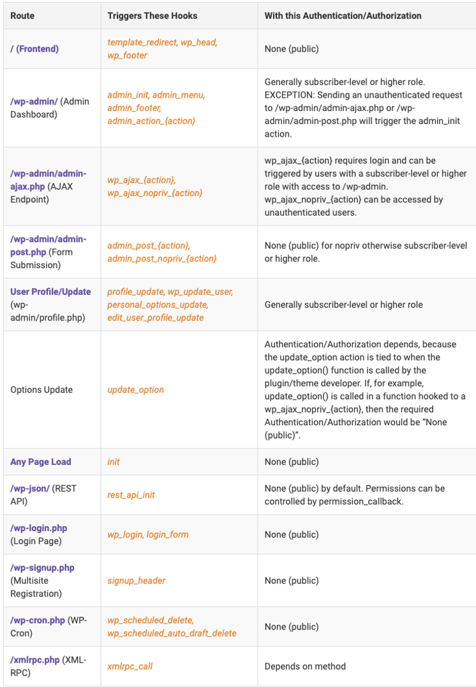

## Hacking WordPress

**Actions**: hooks that WP core launches during execution or when certain events occur
•	do_action() — set the action & executes all actions hooked to it when called
•	add_function() — plugins/themes create custom functions to hook using this

**Filters**: similar to actions but modifies data before sending to db or browser
•	apply_filter() — will trigger all functions hooked to the filter
•	add_filter() — hooks plugins/themes functions with this


Important routes:



## Important Actions

•	init
o	Fires after WordPress has finished loading but before any headers are sent. This is an early stage in the WordPress loading process, making it a critical point for initializing plugin or theme functionalities.
•	admin_init
o	Triggers before any other hook when a user accesses the admin area (/wp-admin). Despite the name, this action can be triggered by unauthenticated users.
•	wp_ajax_{action} 
o	A core part of the admin-side AJAX functionality. It’s used to handle authenticated AJAX requests.
•	wp_ajax_nopriv_{action}
o	Similar to wp_ajax_{action}, but specifically for handling unauthenticated AJAX requests. This hook is crucial for AJAX functionality available to public users.
•	admin_post and admin_post_nopriv 
o	These hooks are used for handling form submissions in the WordPress admin area for authenticated (admin_post) and unauthenticated (admin_post_nopriv) users.
•	admin_action_{action} 
o	Triggered in response to admin actions. It’s a versatile hook for custom admin functionalities and can be accessed via both GET and POST requests.
•	profile_update
o	Fires when a user’s profile is updated. It’s an important hook for executing actions post-user update.
•	wp_update_user
o	Similar to profile_update, this action occurs when a user’s data is updated. It is crucial for managing user information.
•	personal_options_update
o	This hook is triggered when a user updates their own profile in the WordPress admin area. It allows developers to execute custom code when a user updates their personal settings.
•	edit_user_profile_update
o	This hook is triggered when an admin or another user with the appropriate permissions updates another user’s profile. It allows developers to execute custom code during the profile update process for other users. It’s almost always used with personal_options_update.


## Important Filters
•	the_content
o	Filters the post content before it’s sent to the browser. If improperly sanitized, it can lead to XSS attacks.
•	the_title
o	Similar to the_content, this filter can be a vector for XSS if the title output is not properly escaped.
•	user_has_cap
o	Filters a user’s capabilities and can be used to alter permissions, potentially leading to privilege escalation.
•	authenticate
o	Filters the authentication process. If overridden or improperly extended, it can lead to authentication bypass vulnerabilities.

### Triggering functions

## Consider the following function:

```
function handle_file_upload() {
     if (isset($_FILES[‘file’]) {
    $file = $_FILES[‘file’]);
        […]
      wp_die(); // Required to terminate and return a response
}

add_action(‘wp_ajax_upload_file’, ‘handle_file_upload’)
```

This is triggered via
```
POST /wp-admin/admin-ajax.php HTTP/1.1
Host: example-wordpress-site.com
Content-Type: multipart/form-data; boundary=----WebKitFormBoundaryePkpFF7tjBAqx29L
Content-Length: ...

------WebKitFormBoundaryePkpFF7tjBAqx29L
Content-Disposition: form-data; name="action"

upload_file
------WebKitFormBoundaryePkpFF7tjBAqx29L
Content-Disposition: form-data; name="file"; filename="malicious.php"
Content-Type: application/x-php

<@INCLUDE *malicious PHP file content here*@>
------WebKitFormBoundaryePkpFF7tjBAqx29L--
```

## Example #2

```
function plugin_template_includer_init() {
    if (isset($_GET['template'])) {
        $template = $_GET['template'];
[…]
        include('/path/to/templates/' . $template . '.php');
    }
}
 
// Hooking into 'admin_init'
add_action('admin_init', 'plugin_template_includer_init');
```

Triggered by
```
http://example-wordpress-site.com/wp-admin/?page=some_plugin_page&log_file=../../../../malicious
```
